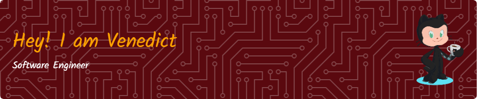

  <strong>Software Engineer · Computer Science Student @ University of Indonesia</strong> 
  Enthusiastic about building software, solving problems, and always learning.

---

<h3 align="center">🧠 About Me</h3>

  🎓 Currently deepening my knowledge in <strong>Computer Science</strong>  
  🛠️ Passionate about <strong>Software Engineering</strong>, <strong>Web Development</strong>, and building impactful products  
  📫 Reach me at <a href="mailto:venedictchen@gmail.com"><strong>venedictchen@gmail.com</strong></a>

<!-- GitHub stats from https://github.com/anuraghazra/github-readme-stats -->

<!--

Here are some ideas to get you started:

- 🔭 I’m currently working on ...
- 🌱 I’m currently learning ...
- 👯 I’m looking to collaborate on ...
- 🤔 I’m looking for help with ...
- 💬 Ask me about ...

- 😄 Pronouns: ...
- ⚡ Fun fact: ...
-->
